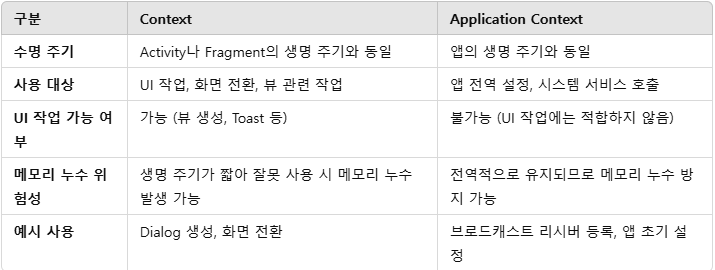

 # Application Context vs Context
## 1. Context란?
- Context는 안드로이드 앱에서 리소스 접근, UI 작업, 시스템 서비스 호출 등을 가능하게 해주는 핸들러 같은 역할을 한다.
- 예를 들어, 화면 전환, 버튼 클릭 시 Toast 메시지 띄우기 등 앱 내부의 모든 작업에 필요하다.
## 2. Application Context란?
- Application Context는 앱의 전역 Context로, 앱 전체에서 공통적으로 사용되는 리소스나 설정에 접근할 때 사용된다.
- 앱의 생명 주기와 동일하며, UI 작업에는 적합하지 않다.
## 3. Context vs Application Context


## 4. 사용 예제
1) Context 사용 (UI 작업)

```kotlin
val dialog = AlertDialog.Builder(context)
    .setTitle("Dialog 예제")
    .setMessage("Context를 사용한 Dialog입니다.")
    .setPositiveButton("확인", null)
    .create()
dialog.show()
2) Application Context 사용 (전역 작업)
```
```kotlin
val appContext = context?.applicationContext
Toast.makeText(appContext, "앱 전역 Context 사용!", Toast.LENGTH_SHORT).show()
```

## 5. 요약
Context는 Activity와 Fragment에서 UI 작업에 사용되며, 뷰와 연결된 작업에 적합하다.
Application Context는 앱 전역에서 데이터나 설정을 공유해야 할 때 유용하지만, UI와 관련된 작업에는 사용할 수 없다.
특히 메모리 누수를 방지하기 위해 전역적으로 필요한 경우에는 Application Context를 사용해야 한다는 점을 명심하자.